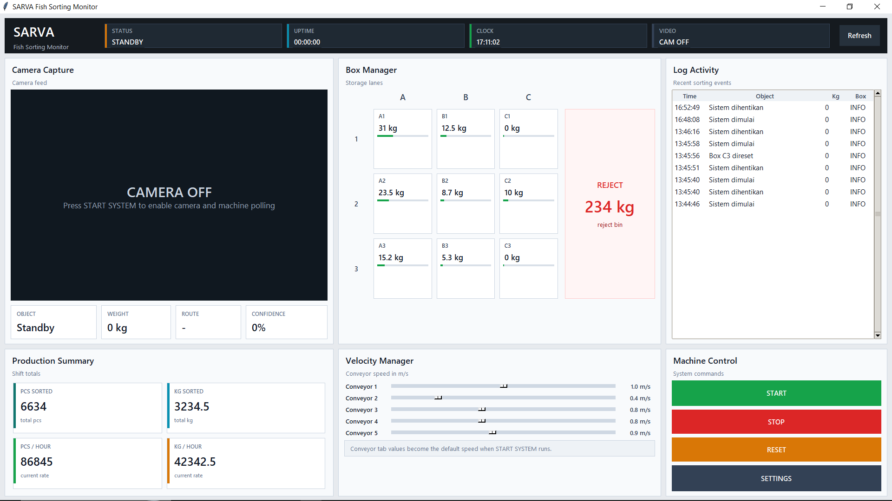
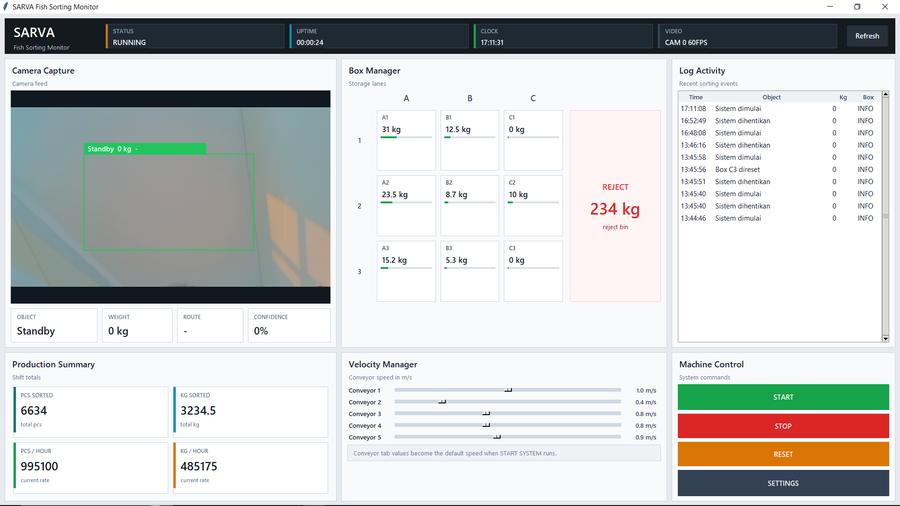
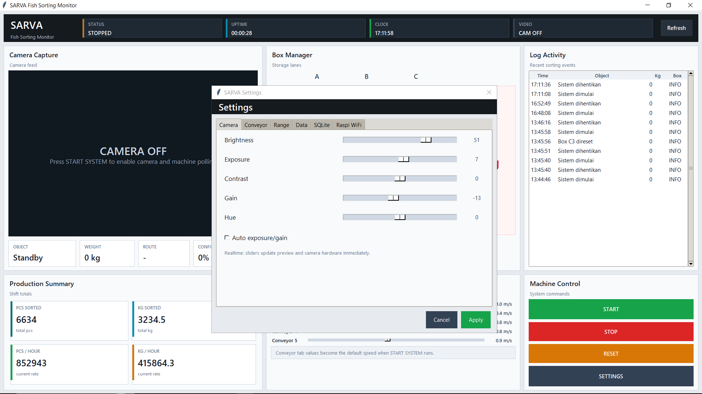
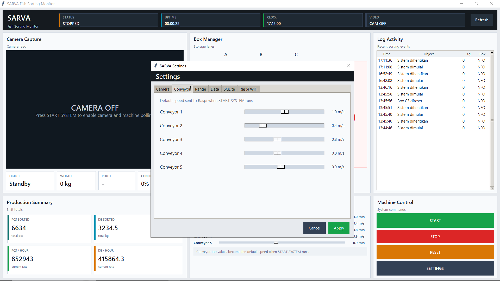
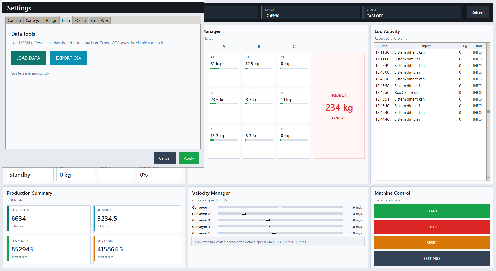
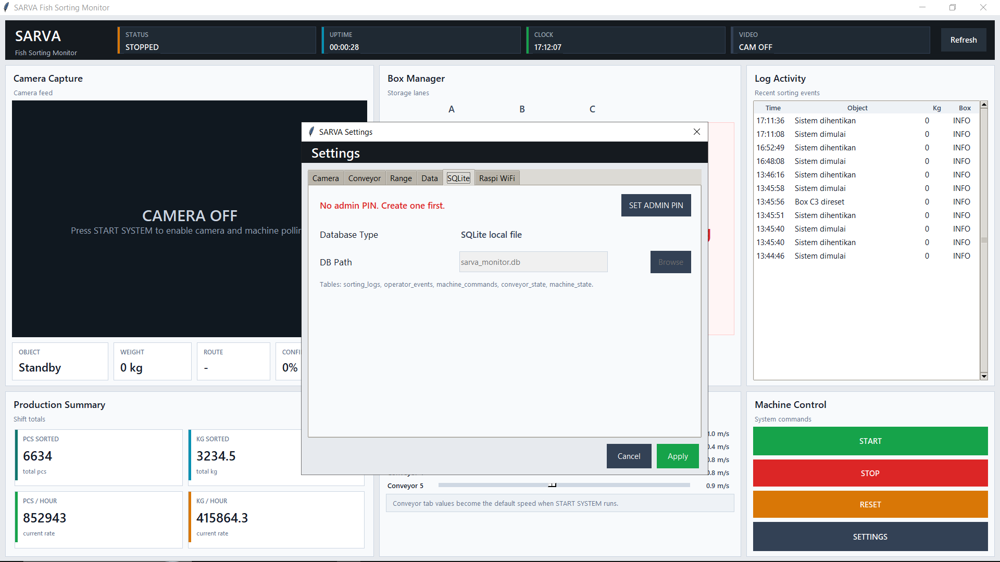
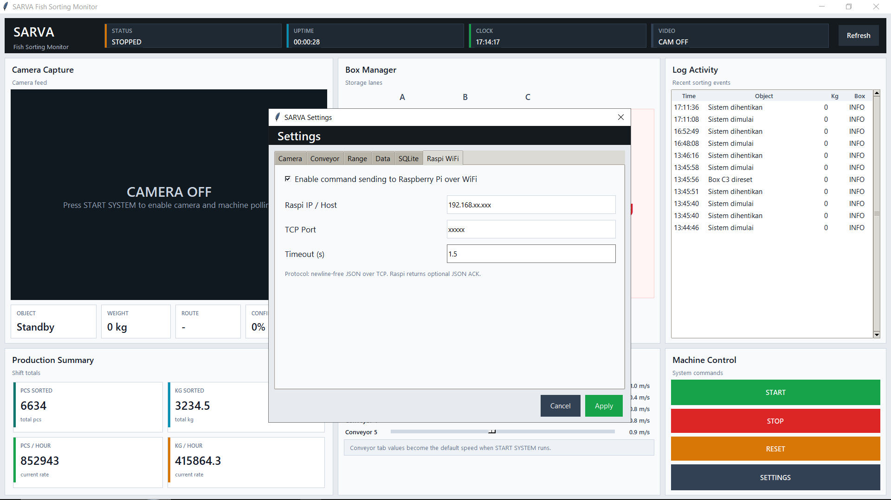

# Panduan Penggunaan SARVA Fish Sorting Monitor

Dokumen ini dipakai untuk operator, teknisi, dan supervisor yang menjalankan aplikasi monitoring mesin sorting ikan. Aplikasi berjalan di PC. PC membaca data produksi, menampilkan kondisi mesin, menyimpan event ke SQLite, dan mengirim perintah ke Raspberry Pi melalui TCP WiFi.

Raspberry Pi menangani perangkat lapangan seperti GPIO, relay, VFD, serial/COM, atau controller lain sesuai wiring produksi.

## 1. File Aplikasi

File yang dipakai di produksi:

- `Testing-UI/main.py` untuk menjalankan dashboard PC.
- `Testing-UI/settings.json` untuk konfigurasi kamera, conveyor, database, dan koneksi Raspi.
- `Testing-UI/data.json` untuk data monitoring yang dibaca dashboard.
- `Testing-UI/raspi_bridge_server.py` sebagai contoh bridge TCP JSON di Raspberry Pi.
- `Testing-UI/requirements.txt` untuk daftar package Python.
- `docs/screenshots/` untuk gambar panduan.

File database SQLite dibuat otomatis saat aplikasi berjalan. Nama default database: `sarva_monitor.db`.

## 2. Instalasi di PC

1. Install Python 3.10 atau versi lebih baru.
2. Buka terminal di folder project.

```powershell
cd "<folder-project>"
```

3. Install dependency.

```powershell
python -m pip install -r "Testing-UI\requirements.txt"
```

4. Jalankan aplikasi.

```powershell
python "Testing-UI\main.py"
```

Package utama:

- `opencv-python` untuk membaca kamera dan mengatur property kamera.
- `Pillow` untuk merender frame kamera ke Tkinter.
- Library bawaan Python: `tkinter`, `sqlite3`, `socket`, `json`, `csv`, `threading`, `hashlib`, dan `pathlib`.

## 3. Dashboard Saat Standby



Saat aplikasi pertama dibuka, status mesin berada di `STANDBY` atau `STOPPED`. Kamera belum aktif. Operator mulai kerja dari panel `Machine Control` di kanan bawah.

Bagian atas layar berisi ringkasan sistem:

- `STATUS` menunjukkan kondisi mesin: `STANDBY`, `RUNNING`, `STOPPED`, atau `RESET`.
- `UPTIME` menghitung lama sistem berjalan setelah tombol `START` ditekan.
- `CLOCK` menampilkan jam PC.
- `VIDEO` menunjukkan status kamera, misalnya `CAM OFF` atau `CAM 0 60FPS`.
- `Refresh` memuat ulang `data.json` dan `settings.json`.

Panel utama:

- `Camera Capture` menampilkan feed kamera dan overlay deteksi.
- `Box Manager` menampilkan isi box A1 sampai C3 serta reject bin.
- `Log Activity` menampilkan event mesin dan event operator.
- `Production Summary` menampilkan total pcs, total kg, pcs/jam, dan kg/jam.
- `Velocity Manager` menampilkan speed conveyor dalam `m/s`.
- `Machine Control` berisi tombol operasi utama.

## 4. Tombol Machine Control

Panel `Machine Control` berada di kanan bawah. Tombol disusun dari atas ke bawah.

`START`

- Menyalakan kamera.
- Memulai polling data produksi.
- Mengirim command `system_start` ke Raspberry Pi.
- Mengirim default speed conveyor yang tersimpan di tab `Conveyor`.
- Menulis event start ke SQLite.

`STOP`

- Mematikan kamera.
- Menghentikan polling data.
- Mengirim command `system_stop` ke Raspberry Pi.
- Menulis event stop ke SQLite.

`RESET`

- Meminta dua konfirmasi sebelum proses berjalan.
- Menyimpan snapshot data sebelum reset ke tabel `reset_events`.
- Mengirim command `system_reset` ke Raspberry Pi.
- Mengosongkan statistik tampilan setelah konfirmasi benar.

`SETTINGS`

- Membuka jendela pengaturan.
- Isi pengaturan disimpan setelah operator menekan `Apply`.
- Tombol `Cancel` menutup jendela tanpa menyimpan perubahan terakhir.

## 5. Menjalankan Sistem



Tekan `START` saat mesin siap. Setelah start:

1. `STATUS` berubah menjadi `RUNNING`.
2. `UPTIME` mulai menghitung.
3. `VIDEO` menampilkan status kamera dan FPS.
4. `Camera Capture` menampilkan feed kamera.
5. `Log Activity` mencatat event `Sistem dimulai`.
6. Raspberry Pi menerima default speed conveyor.

Selama sistem berjalan, operator memantau tiga area utama:

- Kamera untuk melihat object, weight, route, dan confidence.
- Box Manager untuk melihat kapasitas tiap box.
- Velocity Manager untuk melihat speed conveyor yang sedang dipakai.

Tekan `STOP` sebelum maintenance, pergantian shift, pengecekan kamera, atau saat mesin harus dihentikan.

## 6. Camera Capture

Panel kamera menampilkan video dari kamera utama. Aplikasi menjaga aspect ratio frame supaya gambar tidak tertarik. Saat kamera aktif, overlay hijau menampilkan area deteksi.

Data di bawah kamera:

- `OBJECT` berisi jenis object terakhir.
- `WEIGHT` berisi berat object terakhir.
- `ROUTE` berisi tujuan box.
- `CONFIDENCE` berisi nilai confidence deteksi.

Jika kamera tidak tersedia, aplikasi tetap menampilkan mode simulasi agar dashboard masih bisa diuji.

## 7. Production Summary

Panel ini dipakai untuk membaca performa shift:

- `PCS SORTED` untuk total ikan yang sudah diproses.
- `KG SORTED` untuk total berat.
- `PCS / HOUR` untuk laju pcs per jam.
- `KG / HOUR` untuk laju berat per jam.

Nilai berasal dari `data.json` atau proses integrasi yang menulis data ke file tersebut.

## 8. Box Manager

Box Manager menampilkan jalur penyimpanan A1 sampai C3. Tiap box mempunyai angka berat dan bar kapasitas.

Warna bar:

- Hijau untuk kapasitas normal.
- Oranye untuk kapasitas mendekati penuh.
- Merah untuk kapasitas tinggi dan perlu perhatian operator.

Reject bin berada di sisi kanan panel. Bagian ini menghitung total berat item reject.

Klik box atau reject bin saat operator perlu reset nilai box tertentu. Aplikasi meminta konfirmasi sebelum reset dan mencatat event ke SQLite.

## 9. Velocity Manager

Velocity Manager menampilkan speed conveyor dalam `m/s`. Nilai yang tampil mengikuti konfigurasi conveyor.

Skala nilai:

- `0` berarti `0.0 m/s`.
- `8` berarti `0.8 m/s`.
- `20` berarti `2.0 m/s`.

Slider conveyor dibuat rapat agar operator bisa membandingkan speed antar conveyor tanpa banyak gerak mata. Perubahan slider disimpan dan bisa dikirim ke Raspberry Pi sesuai command conveyor.

## 10. Log Activity

Log Activity menampilkan event terbaru dari sistem. Kolom yang tersedia:

- `Time` untuk waktu event.
- `Object` untuk nama object atau event operator.
- `Kg` untuk nilai berat.
- `Box` untuk tujuan box atau status info.

Contoh event:

- `Sistem dimulai`
- `Sistem dihentikan`
- `Box B2 direset`
- hasil sorting ke box tertentu

Log tersimpan ke SQLite dan bisa diekspor ke CSV dari menu Settings.

## 11. Settings: Camera



Tab `Camera` dipakai untuk mengatur tampilan dan property kamera.

Field yang tersedia:

- `Brightness` mengatur terang gambar.
- `Exposure` mengatur nilai exposure.
- `Contrast` mengatur kontras.
- `Gain` mengatur penguatan sinyal kamera.
- `Hue` mengatur pergeseran warna.
- `Auto exposure/gain` mengaktifkan penyesuaian otomatis.

Perubahan slider langsung diterapkan ke preview dan hardware kamera jika kamera mendukung property tersebut. Setelah nilai sesuai, tekan `Apply`.

## 12. Settings: Conveyor



Tab `Conveyor` menyimpan default speed saat sistem dinyalakan. Nilai ini dikirim ke Raspberry Pi ketika operator menekan `START`.

Cara set default conveyor:

1. Buka `SETTINGS`.
2. Pilih tab `Conveyor`.
3. Geser slider conveyor yang diperlukan.
4. Pastikan satuan di kanan slider sudah sesuai dalam `m/s`.
5. Tekan `Apply`.

Tidak ada tombol stop per conveyor di tab ini. Stop seluruh sistem dilakukan dari tombol `STOP` pada panel Machine Control.

## 13. Settings: Range


Tab `Range` menyimpan mapping koordinat tujuan box. Setiap box mempunyai dua nilai koordinat.

Data yang diatur:

- A1 sampai C3 untuk jalur box normal.
- `TRASH` untuk reject bin.

Gunakan tab ini saat teknisi mengubah posisi mekanik, jalur diverter, mapping servo, atau koordinat routing di sisi Raspberry Pi. Setelah perubahan selesai, tekan `Apply`.

## 14. Settings: Data



Tab `Data` berisi alat untuk memuat dan mengambil data.

`LOAD DATA`

- Membaca ulang `Testing-UI/data.json`.
- Memperbarui dashboard tanpa restart aplikasi.
- Dipakai saat proses lain menulis data baru ke file monitoring.

`EXPORT CSV`

- Mengekspor log sorting yang terlihat.
- File CSV dipakai untuk laporan shift, audit produksi, atau pengecekan event.

Baris SQLite di bawah tombol menampilkan nama database yang sedang dipakai.

## 15. Settings: SQLite



Tab `SQLite` dilindungi PIN admin. Operator biasa tidak perlu mengubah bagian ini.

Saat belum ada PIN:

1. Supervisor membuka tab `SQLite`.
2. Tekan `SET ADMIN PIN`.
3. Buat PIN minimal 6 karakter.
4. Simpan perubahan.

Setelah PIN dibuat, perubahan DB Path hanya bisa dilakukan oleh user yang mengetahui PIN.

Tabel SQLite:

- `sorting_logs` untuk hasil sorting.
- `operator_events` untuk event start, stop, reset, dan reset box.
- `machine_commands` untuk command yang dikirim ke Raspberry Pi.
- `conveyor_state` untuk perubahan speed conveyor.
- `machine_state` untuk status mesin terakhir.
- `reset_events` untuk snapshot sebelum reset.

## 16. Settings: Raspi WiFi



Tab `Raspi WiFi` mengatur koneksi PC ke Raspberry Pi.

Field yang tersedia:

- `Enable command sending to Raspberry Pi over WiFi` mengaktifkan atau mematikan pengiriman command.
- `Raspi IP / Host` berisi alamat IP Raspberry Pi.
- `TCP Port` berisi port service di Raspberry Pi.
- `Timeout (s)` berisi batas tunggu koneksi.

Protocol yang dipakai: JSON melalui TCP tanpa newline. Raspberry Pi dapat mengirim ACK JSON sebagai balasan.

## 17. Format Command ke Raspberry Pi

PC mengirim payload JSON ke Raspberry Pi.

Start:

```json
{"command":"system_start","status":"RUNNING"}
```

Stop:

```json
{"command":"system_stop","status":"STOPPED"}
```

Reset:

```json
{"command":"system_reset","status":"RESET"}
```

Set conveyor:

```json
{"command":"set_conveyor_speed","conveyor_key":"conveyor_1","speed_ms":0.8,"raw_value":8}
```

Reset box:

```json
{"command":"reset_box","box":"A1"}
```

Reset reject bin:

```json
{"command":"reset_reject_bin","box":"TRASH"}
```

## 18. Setup Raspberry Pi

1. Salin file bridge ke Raspberry Pi.

```text
Testing-UI/raspi_bridge_server.py
```

2. Jalankan service di Raspberry Pi.

```bash
python3 raspi_bridge_server.py
```

3. Cek koneksi dari PC ke Raspberry Pi.

```powershell
ping <ip-raspi>
```

4. Cek port TCP.

```powershell
Test-NetConnection <ip-raspi> -Port <port>
```

5. Isi fungsi integrasi di `raspi_bridge_server.py` sesuai wiring produksi:

- `apply_system_start`
- `apply_system_stop`
- `apply_system_reset`
- `apply_conveyor_speed`
- `apply_reset_box`
- `apply_reset_reject_bin`

Contoh alur conveyor:

```text
raw_value 8 -> 0.8 m/s -> Raspberry Pi kirim nilai ke VFD, serial/COM, GPIO, atau controller conveyor
```

## 19. Format Data Monitoring

Dashboard membaca `Testing-UI/data.json`. Proses lain boleh menulis file ini selama formatnya tetap sama.

Contoh format:

```json
{
  "info_data": {
    "pcs_sorted": "6634",
    "kg_sorted": "3234.5",
    "pcs_per_hour": "63",
    "kg_per_hour": "293"
  },
  "box_manager": {
    "A1": "31",
    "A2": "23.5",
    "A3": "15.2",
    "B1": "12.5",
    "B2": "8.7",
    "B3": "5.3",
    "C1": "0",
    "C2": "10",
    "C3": "82.1"
  },
  "trash": "234",
  "log_activity": []
}
```

## 20. Alur Kerja Operator

1. Nyalakan PC, kamera, dan panel mesin.
2. Jalankan aplikasi SARVA.
3. Pastikan `STATUS` berada di `STANDBY` atau `STOPPED`.
4. Cek IP Raspberry Pi di `Settings > Raspi WiFi`.
5. Cek default speed di `Settings > Conveyor`.
6. Tekan `START`.
7. Pantau kamera, box, log, dan velocity.
8. Tekan `STOP` saat produksi selesai atau mesin perlu dihentikan.
9. Gunakan `RESET` hanya setelah supervisor/operator berwenang menyetujui reset.
10. Export CSV dari `Settings > Data` jika laporan shift dibutuhkan.

## 21. Catatan Troubleshooting

Kamera tidak tampil:

- Pastikan kamera terpasang di Windows.
- Cek status `VIDEO` di header.
- Buka `Settings > Camera`, lalu ubah brightness atau exposure untuk memastikan preview merespons.

Command tidak sampai ke Raspberry Pi:

- Pastikan checkbox WiFi command aktif.
- Cek IP dan port di `Settings > Raspi WiFi`.
- Jalankan ulang `raspi_bridge_server.py` di Raspberry Pi.
- Cek log command di SQLite.

Data tidak berubah:

- Tekan `Refresh`.
- Cek isi `Testing-UI/data.json`.
- Pastikan proses produksi menulis format JSON yang benar.

Database tidak bisa diubah:

- Buat Admin PIN lebih dulu.
- Masukkan PIN supervisor saat mengubah DB Path.
- Gunakan SQLite lokal untuk mode produksi kecuali teknisi meminta lokasi lain.
