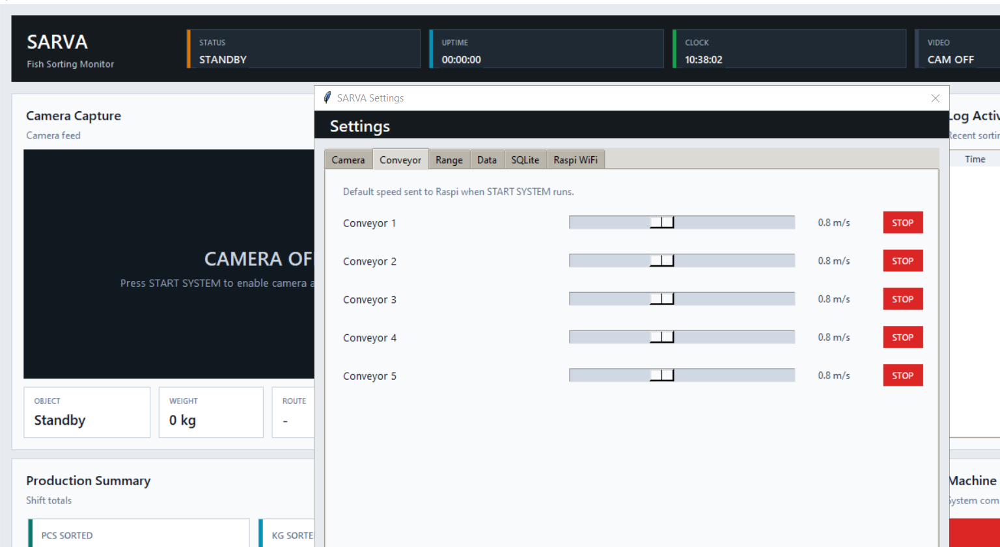
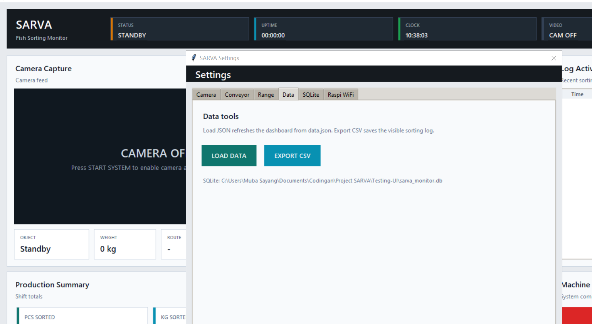
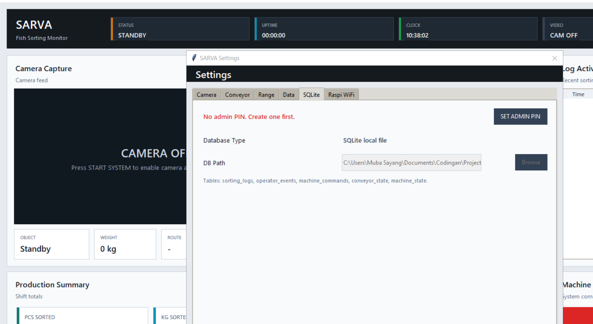
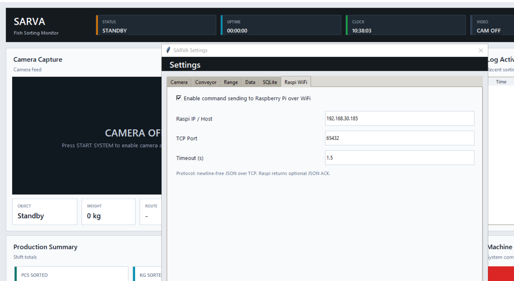

# SARVA Fish Sorting Monitor

Dashboard ini berjalan di PC. PC mengirim perintah ke Raspberry Pi lewat WiFi. Raspberry Pi yang menggerakkan GPIO, COM, relay, VFD, atau controller mesin.

## File Produksi

- `Testing-UI/main.py`: aplikasi PC.
- `Testing-UI/settings.json`: konfigurasi kamera, conveyor default, SQLite, dan Raspi.
- `Testing-UI/data.json`: data monitoring yang dibaca dashboard.
- `Testing-UI/raspi_bridge_server.py`: service TCP JSON untuk Raspberry Pi.
- `Testing-UI/requirements.txt`: dependency Python.

## Install PC

1. Install Python 3.10 atau lebih baru.
2. Masuk ke folder project.

```powershell
cd "<folder-project>"
```

3. Install dependency.

```powershell
python -m pip install -r "Testing-UI\requirements.txt"
```

4. Jalankan dashboard.

```powershell
python "Testing-UI\main.py"
```

## Tampilan Utama


Status awal berada di `STANDBY`. Kamera mati sampai operator menekan `START SYSTEM`.

Panel utama:

- `Camera Capture`: feed kamera saat sistem jalan.
- `Production Summary`: total pcs, total kg, pcs/jam, kg/jam.
- `Box Manager`: isi box A1 sampai C3 dan reject bin.
- `Velocity Manager`: speed conveyor dalam `m/s`.
- `Log Activity`: event sorting terakhir.
- `Machine Control`: START, STOP, RESET, Settings.

## START dan STOP

`START SYSTEM` melakukan ini:

- menyalakan kamera;
- mulai polling `data.json`;
- mengirim command `system_start` ke Raspberry Pi;
- mengirim default speed conveyor dari tab Conveyor;
- mencatat event ke SQLite.

`STOP SYSTEM` melakukan ini:

- mematikan kamera;
- menghentikan polling;
- mengirim command `system_stop` ke Raspberry Pi;
- mencatat event ke SQLite.

`RESET SYSTEM` meminta dua konfirmasi:

1. pilih `Yes` pada dialog pertama;
2. ketik `RESET` pada dialog kedua.

Setelah konfirmasi benar, aplikasi menyimpan snapshot sebelum reset ke tabel `reset_events`, mencatat event operator, mengirim `system_reset` ke Raspi, lalu mengosongkan statistik tampilan.

## Setting Conveyor



Nilai di tab Conveyor adalah default saat sistem dinyalakan. Saat `START SYSTEM` ditekan, PC mengirim nilai ini ke Raspi.

Skala UI:

- `0` = `0.0 m/s`
- `8` = `0.8 m/s`
- `20` = `2.0 m/s`

Tombol `STOP` pada tiap conveyor mengubah default lane tersebut ke `0.0 m/s`.

## Data Tools



Menu `Settings > Data` berisi:

- `LOAD DATA`: reload dashboard dari `data.json`;
- `EXPORT CSV`: export log sorting ke file CSV.

Tombol ini dipindahkan ke Settings supaya panel Machine Control hanya berisi perintah mesin.

## Setting SQLite



Setting database dikunci. Pertama kali, supervisor menekan `SET ADMIN PIN`, lalu membuat PIN minimal 6 karakter. Setelah PIN dibuat, perubahan path database butuh PIN.

SQLite dibuat otomatis saat aplikasi berjalan:

```text
Testing-UI\sarva_monitor.db
```

Tabel yang dibuat:

- `sorting_logs`
- `operator_events`
- `machine_commands`
- `conveyor_state`
- `machine_state`
- `reset_events`

## Setting Raspi WiFi



Default:

```text
Host: 192.168.30.185
Port: 65432
Timeout: 1.5 seconds
```

Sesuaikan `Host` dengan IP Raspberry Pi di jaringan produksi.

## Setup Raspberry Pi

1. Copy file ini ke Raspberry Pi:

```text
Testing-UI/raspi_bridge_server.py
```

2. Jalankan di Raspi:

```bash
python3 raspi_bridge_server.py
```

3. Pastikan PC bisa ping Raspi:

```powershell
ping 192.168.30.185
```

4. Pastikan port terbuka:

```powershell
Test-NetConnection 192.168.30.185 -Port 65432
```

## Command PC ke Raspi

PC mengirim JSON TCP tanpa newline. Raspi boleh membalas JSON ACK.

Start:

```json
{"command":"system_start","status":"RUNNING"}
```

Stop:

```json
{"command":"system_stop","status":"STOPPED"}
```

Set conveyor:

```json
{"command":"set_conveyor_speed","conveyor_key":"conveyor_1","speed_ms":0.8,"raw_value":8}
```

Reset reject:

```json
{"command":"reset_reject_bin","box":"TRASH"}
```

## Integrasi GPIO atau COM di Raspi

Buka `raspi_bridge_server.py`, lalu isi fungsi ini sesuai wiring produksi:

- `apply_system_start`
- `apply_system_stop`
- `apply_system_reset`
- `apply_conveyor_speed`
- `apply_reset_box`
- `apply_reset_reject_bin`

Contoh mapping:

```text
conveyor_1 raw_value 8 -> 0.8 m/s -> kirim ke VFD/COM/GPIO dari Raspi
```

## Data Monitoring

Dashboard membaca `Testing-UI\data.json`. Sistem produksi bisa menulis file ini dari proses lain, lalu dashboard menarik perubahan saat sistem berjalan.

Format minimal:

```json
{
  "info_data": {
    "pcs_sorted": "6634",
    "kg_sorted": "3234.5",
    "pcs_per_hour": "63",
    "kg_per_hour": "293"
  },
  "box_manager": {
    "A1": "31",
    "A2": "23.5",
    "A3": "15.2",
    "B1": "12.5",
    "B2": "8.7",
    "B3": "5.3",
    "C1": "0",
    "C2": "10",
    "C3": "82.1"
  },
  "trash": "234",
  "log_activity": []
}
```

## Produksi

Checklist sebelum mesin jalan:

1. PC dan Raspi tersambung ke WiFi yang sama.
2. IP Raspi di tab `Raspi WiFi` benar.
3. `raspi_bridge_server.py` berjalan di Raspi.
4. Kamera terdeteksi oleh Windows.
5. Supervisor sudah membuat Admin PIN.
6. Conveyor default sudah diset.
7. Operator menekan `START SYSTEM`.
